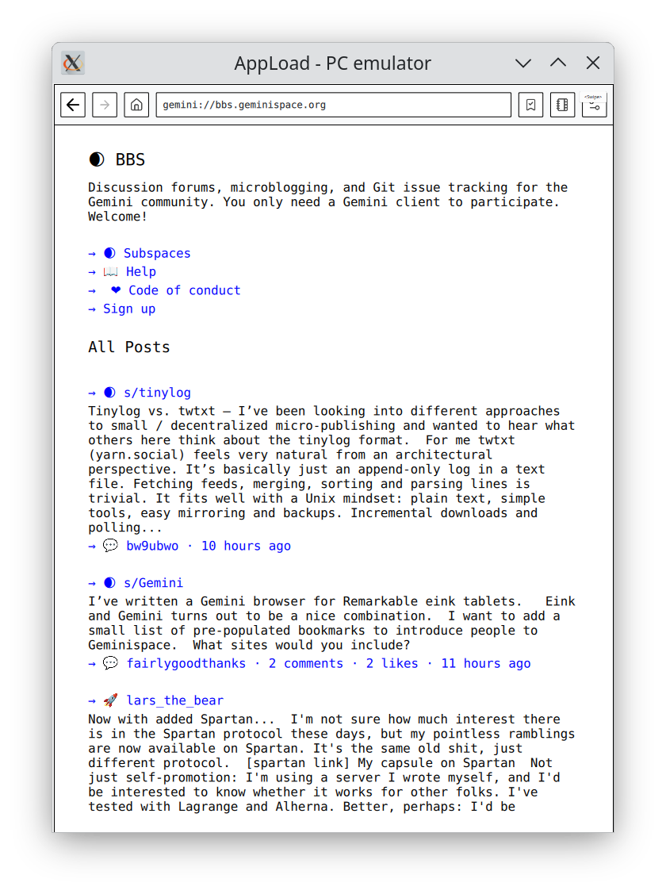

# Irilon - A Gemini Protocol Browser for reMarkable Tablets

A lightweight browser for the Gemini protocol, designed for reMarkable tablets.



## Features

- Basic bookmarks support
- Client certificates
- Inline images

## Installation

Download from releases and copy the folder to your device in:
```
~/xovi/exthome/appload/
```

### Prerequisites

Requires a xovi and rm-appload installation.

https://github.com/asivery/rm-appload
https://github.com/asivery/xovi

I recommend installing these with the Vellum package manager:

https://github.com/rmitchellscott/reManager

## Building a release

Building requires that you have the Go & QT development environments installed. Install the appload emulator to test locally. The local build script assumes that you have an `rm-appload` folder containing a local appload installation.

```bash
# Local build (for testing with appload emulator)
./build.sh 1

# Device build (for deployment)
./build.sh [2/3]
```
